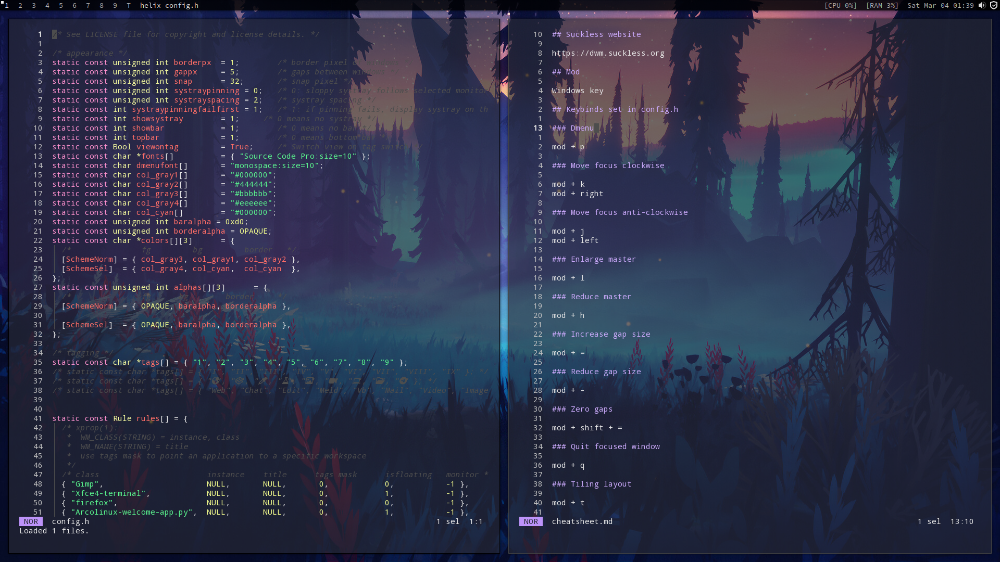

# Arcolinux-DWM



## Download ISO

[Arcolinux torrents](https://fosstorrents.com/distributions/arcolinux/)

## Keybinds

Keybinds are listed in the cheatsheet.

## Post install checklist

1. Remove the following packages using pamac.

```
variety
conky
```

2. Add the following packages using pamac.

```
base devel
helix
transmission-gtk 
yt-dlp 
galculator 
vlc 
audacity
```

3. I like to have a back-up desktop environment in case DWM breaks, so I would also install xfce4 at the terminal.

```
sudo pacman -S xfce4 xfce4-goodies
```

4. Change the default shell to zsh with

```
$ chsh -s /bin/zsh
```

Note that this change will only activate after logging back in.

5. Replace the existing dotfiles with the ones in this repo and make the following scripts executable.

```
.config/dwm-arco/sxhkd/sxhkdrc
.config/autostart.sh
```

6. Recompile DWM with the command

```
make clean install
```

7. Install the following packages from the AUR

```
dracula-gtk-theme
tela-icon-theme
```

8. Open lxappearance and choose your preferred settings.

9. Open nitrogen and choose your default wallpaper.

10. Log out and log back in again.
