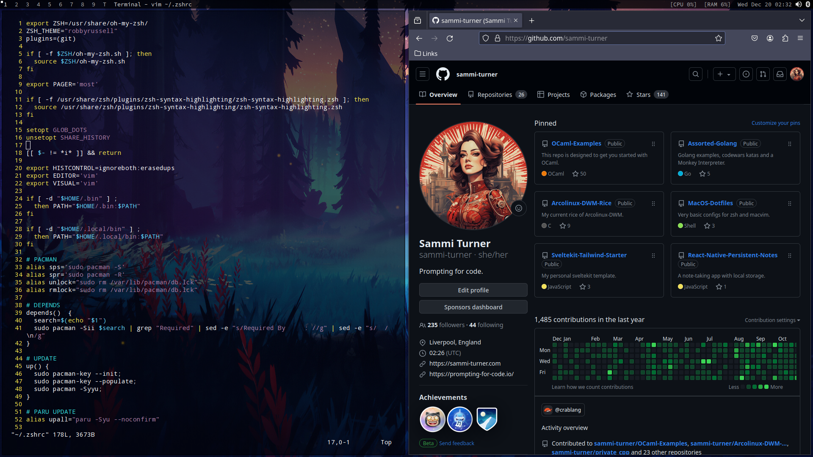

<br>

# Arcolinux-DWM-Rice



<br>

## Download ISO

[Arcolinux torrents](https://fosstorrents.com/distributions/arcolinux/)

<br>

## Keybinds

Keybinds are listed in the cheatsheet.

<br>

## Post install checklist

1. Remove the following cringe packages.

```
variety
conky
rofi
octopi
```

2. Add the following based packages.

```
pamac
base-devel
transmission-gtk 
yt-dlp 
galculator 
vlc 
audacity
kolourpaint
```

3. I like to have a back-up desktop environment in case DWM breaks, so I would also add these packages.

```
xfce4
xfce4-goodies
```

4. For a stylish GTK theme and some icons, install the following packages from the AUR

```
dracula-gtk-theme
tela-icon-theme
```

5. Change the default shell to zsh with

```
$ chsh -s /bin/zsh
```

Note that this change will only activate after logging back in.

6. Replace the existing dotfiles with the ones in this repo, with the possible exception of

```
.config/user-dirs.locale
```

Mine is set to 

```
en_GB
```

but you might prefer US English or a different language instead. Then make the following scripts executable.

```
.config/arco-dwm/sxhkd/sxhkdrc
.config/autostart.sh
```

7. Recompile DWM with the command

```
sudo make clean install
```

8. Open lxappearance and choose your preferred settings.

9. Open nitrogen and choose your default wallpaper.

10. Log out and log back in again.
